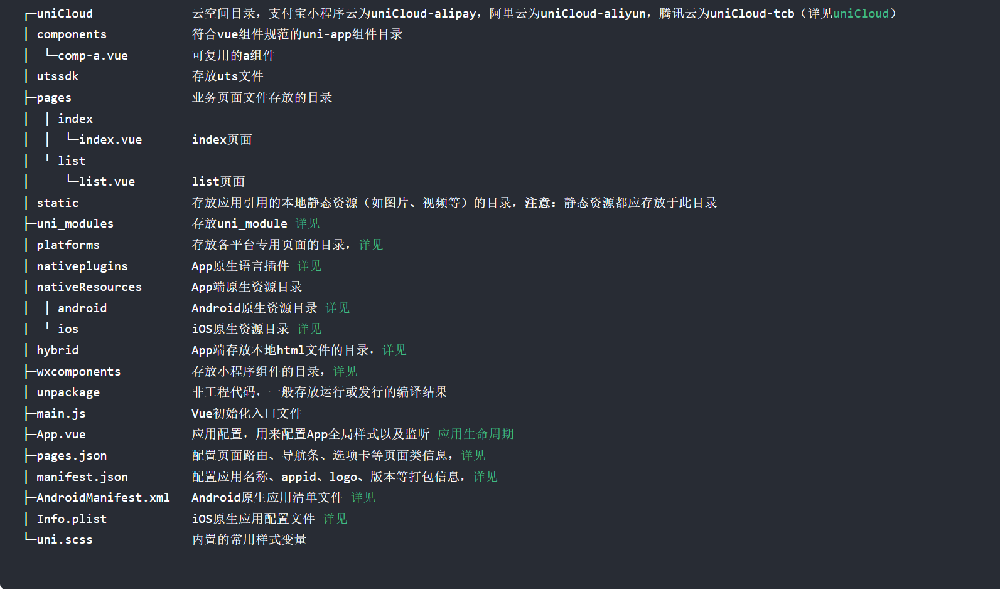

1、UniApp是什么？
    答：uni-app 是一个使用 Vue.js 开发所有前端应用的框架，开发者编写一套代码，可发布到iOS、Android、Web（响应式）、以及各种小程序（微信/支付宝/百度/头条/飞书/QQ/快手/钉钉/淘宝）、快应用等多个平台。
2、项目结构

3、条件编译
    答：在uni-app中，使用 #ifdef 和 #endif 分别定义条件编译块，在条件编译块中编写不同的代码，根据不同的平台进行编译。
    例如：
    #ifdef H5
    console.log('当前运行在H5平台');
    #endif
    #ifdef MP-WEIXIN
    console.log('当前运行在微信小程序平台');
    #endif
    #ifdef MP-ALIPAY
    console.log('当前运行在支付宝小程序平台');
    #endif
    #ifdef MP-BAIDU
    console.log('当前运行在百度小程序平台');
    #endif
    #ifdef MP-TOUTIAO
    console.log('当前运行在字节跳动小程序平台');
    #endif
    #ifdef MP-QQ
    console.log('当前运行在QQ小程序平台');
    #endif
    #ifdef MP-KUAISHOU
    console.log('当前运行在快手小程序平台');
    #endif

4、uniapp选择器有2个变化：*选择器不支持；元素选择器里没有body，改为了page。微信小程序即是如此,单位方面，px无法动态适应不同宽度的屏幕，rem无法用于nvue/weex。如果想使用根据屏幕宽度自适应的单位，推荐使用rpx，全端支持。推荐使用flex布局。注意css里背景图和字体文件，尽量不要大于40k，因为会影响性能。在小程序端，如果要大于40k，需放到服务器侧远程引用或base64后引入，不能放到本地作为独立文件引用

5、工程结构和页面管理 每个可显示的页面，都必须在 pages.json 中注册。pages.json类似于小程序的app.json,这里没有vue的路由，都是在pages.json里管理。
uni-app的首页，是在pages.json里配的，page节点下第一个页面就是首页。一般在/pages/xx的目录下。
app和小程序中，为了提升体验，页面提供了原生的导航栏和底部tabbar，注意这些配置是在pages.json中做，而不是在vue页面里创建，但点击事件的监听在显示的vue页面中做。

6、uni-app打包成App后，支持webview渲染和weex原生渲染这2种引擎，可以任由开发者切换使用。
webview渲染方式，架构和微信小程序一样。微信小程序的Hybrid应用框架是业内体验上的标杆，实践证明这种体验足以承载一线互联网开发商获得上亿用户。uni-app的App端体验同微信小程序，超过其他平台的小程序，超过一般的hybrid框架。
原生渲染方式，是DCloud改造了weex引擎，在原生渲染引擎上实现了uni-app的组件和API。达到更优秀的用户体验。

7、Android端支持引入腾讯x5浏览器内核，可以抹平低端Android的浏览器兼容性问题 。使用X5内核模块提交云端打包后才能生效，真机运行调试时请使用自定义基座
CPU类型配置不支持“x86” ，建议仅配置“armeabi-v7a”
   X5浏览器内核解决的问题：
     x5适配了rom的自定义主题字体，与原生字体保持一致。不会出现一个界面部分字体为原生字体、部分字体为webview字体的问题。
     如果你想使用比如sticky等新css语法，此时可通过x5拉齐。如果开发者比较注意，不使用太新的语法的话，其实此时x5在这方面没有用处。
     x5内核自带的video实现强于html的video，支持视频格式更多。（这个只能用于5+app和wap2app的html里的自带video，以及uni-app的web-view组件里的video。uni-app默认的video组件本身就是原生的，和x5无关）
     远程web页面防劫持是x5内核的一大亮点
     可通过plus.navigator.getUserAgent判断UA中是否包含MQQBrowser关键字判断当前webview是否为X5渲染。
x5内核的UserAgent如下：
     Mozilla/5.0 (Linux; Android 11; PEXM00 Build/RKQ1.201217.002; wv) AppleWebKit/537.36 (KHTML, like Gecko) Version/4.0 Chrome/77.0.3865.120 MQQBrowser/6.2 TBS/045738
 x5详情见[text](https://uniapp.dcloud.net.cn/tutorial/app-android-x5.html)

 8、原生组件层级问题 H5没有原生组件概念问题，非H5端有原生组件并引发了原生组件层级高于前端组件的概念，要遮挡video、map等原生组件，请使用cover-view组件。

 9、App端新增了renderjs，这是一种运行在视图层的js，vue页面通过renderjs可以操作浏览器对象，进而可以让基于浏览器的库直接在uni-app的App端运行，诸如echart、threejs

 10、uni-app的tag同小程序的tag，和HTML的tag不一样，比如div要改成view，span要改成text、a要改成navigator。
出于降低h5应用向uni-app迁移成本的考虑，写成div、span也可以运行在app和小程序上，因为uni-app编译器会把这些HTML标签编译为小程序标签。但仍然建议养成新习惯。

11、单位方面，uni-app默认为rpx。这是一种可跨端的通用单位

12、工程目录注意
页面文件：放到pages目录下；推荐方案：新建一个页面目录，然后创建一个目录同名的.vue文件，如/pages/list/list.vue，接着在pages.json里完成注册。这与小程序的策略相同。
自定义组件：放到component目录
静态资源：如图片，固定放到static目录下。这是webpack的规则

13、虽然使用vue，但在app和小程序里，不是spa而是mpa。

14、uni-app 新增了2个css变量：--window-top 和 --window-bottom，这代表了页面的内容区域距离顶部和底部的距离。举个实例，如果你想在原生tabbar 上方悬浮一个菜单，之前写 bottom:0。这样的写法编译到 h5 后，这个菜单会和 tabbar 重叠，位于屏幕底部。而改为使用 bottom:var(--window-bottom)，则不管在 app 下还是在h5下，这个菜单都是悬浮在 tabbar 上浮的。

15、CSS 內使用 vh 单位的时候注意 100vh 包含导航栏，使用时需要减去导航栏和 tabBar 高度，部分浏览器还包含浏览器操作栏高度，使用时请注意。

16、组件内（页面除外）不支持 onLoad、onShow 等页面生命周期。

17、为避免和内置组件冲突，自定义组件请加上前缀（但不能是 u 和 uni）。比如可使用的自定义组件名称：my-view、m-input、we-icon，例如不可使用的自定义组件名称：u-view、uni-input，如果已有项目使用了可能造成冲突的名称，请修改名称，另外微信小程序下自定义组件名称不能以 wx 开头。

18、微信（可以使用virtualHost配置）/QQ/百度/抖音这四家小程序，自定义组件在渲染时会比App/H5端多一级节点，在写样式时需要注意

19、使用flex布局时，直接给自定义组件的父元素设置为display:flex不能影响到自定义组件内部的根节点，需要设置当前自定义组件为display:flex才可以。

20、在自定义组件内部设置根元素高度为100%，不能撑满自定义组件父元素。需要同时设置当前自定义组件高度为100%才可以

21、分包优化[text](https://uniapp.dcloud.net.cn/collocation/manifest.html#%E5%85%B3%E4%BA%8E%E5%88%86%E5%8C%85%E4%BC%98%E5%8C%96%E7%9A%84%E8%AF%B4%E6%98%8E)

22、小程序和App的vue页面，主体是webview渲染的。为了提升性能，小程序和App的vue页面下部分ui元素，比如导航栏、tabbar、video、map使用了原生控件。这种方式被称为混合渲染。

23、不进行 Promise 化 的 API：

同步的方法（即以 sync 结束）。例如：uni.getSystemInfoSync()
以 create 开头的方法。例如：uni.createMapContext()
以 manager 结束的方法。例如：uni.getBackgroundAudioManager()

24、Vue 2 和 Vue 3 的 API Promise 化
Vue 2 和 Vue 3 项目中 API Promise 化 返回格式不一致，以下为 不同点 和 返回格式互相转换

不同点

Vue2 对部分 API 进行了 Promise 封装，返回数据的第一个参数是错误对象，第二个参数是返回数据。此时使用 catch 是拿不到报错信息的，因为内部对错误进行了拦截。
Vue3 对部分 API 进行了 Promise 封装，调用成功会进入 then 方法 回调。调用失败会进入 catch 方法 回调

25、API uniapp API   跨端API在uniapp runtime内置，各种终端都可以使用。各种端的特色能力的API可以通过条件编译来调用，没有任何限制。为了避免uniapp runtime体积过大。不常用的API
通过Ext api 单独封装。仍然是uni.开头，但需要单独下载插件到项目下。

26、manifest.json  AndroidManifest.xml 只能在使用云开发时生效，真机运行时请使用自定义调试基座，AndroidManifest.xml 必须配置android和tools命明空间和package属性

27、移除android权限，，则可以在应用清单文件文件中配置权限并添加tools:node="remove"移除

28、uni-app 项目的static目录，会在打包时把下面包含的所有资源都打包在项目中，所以static目录不要包含没有引用的文件。static目录下也可以包含各种平台子目录，例如web、app、mp-weixin等

29、uni-app static目录和App原生资源目录没有关系，uni-app支持App原生资源目录nativeResources，下面有assets、res等目录、但和static目录没有关系。

30、在 uni-app js 引擎版中，后缀名是.vue文件或.nvue文件。 这些页面均全平台支持，差异在于当 uni-app 发行到App平台时，.vue文件会使用webview进行渲染，.nvue会使用原生进行渲染。
     一个页面可以同时存在vue和nvue，在pages.json的路由注册中不包含页面文件名后缀，同一个页面可以对应2个文件名。重名时优先级如下：

     在非app平台，先使用vue，忽略nvue
     在app平台，使用nvue，忽略vue

view组件相当于HTML的div，text相当于HTML的span，image相当于HTML的img，navigator相当于HTML的a，这些组件在App平台使用原生渲染，在H5平台使用webview渲染。

scroll-view定义一个可滚动的区域
可以定义事件，scrolltolower 滚动到底部或右边触发，scrolltoupper 滚动到顶部或左边触发，scroll 滚动时触发

icon可以定义图标，一般常用uni的扩展插件uni-icons，可以定义属性，type 图标类型，size 图标大小，color 图标颜色，这些属性在App平台使用原生渲染，在H5平台使用webview渲染。

swiper定义一个轮播图，可以定义事件，change 滑动时触发
swiper-item定义轮播图的每一项，可以定义事件，change 滑动时触发

text组件定义文本，可以定义属性，selectable 是否可以长按选择文本，space 保留文字间的空白，可以取值ensp、emsp、nbsp、pre，decode 是否解码，可以取值true、false，这些属性在App平台使用原生渲染，在H5平台使用webview渲染。

rich-text组件定义富文本，可以定义属性，nodes 节点列表，这些属性在App平台使用原生渲染，在H5平台使用webview渲染。

button组件定义按钮，可以定义属性，type 按钮类型，可以取值default、primary、warn，size 按钮大小，可以取值default、mini，disabled 是否禁用，loading 是否显示加载图标，这些属性在App平台使用原生渲染，在H5平台使用webview渲染。

navigator组件定义导航，可以定义属性，url 跳转的页面路径，open-type 打开方式，可以取值navigate、redirect(重定向，不能回退)、switchTab、reLaunch、navigateBack、exit，这些属性在App平台使用原生渲染，在H5平台使用webview渲染。

编程导航：uni.navigateTo({url: '/pages/detail/detail?id=1',success：function(){},fail:function(){}})
uni.redirectTo({url: '/pages/detail/detail?id=1'})
uni.switchTab({url: '/pages/detail/detail?id=1'})
uni.reLaunch({url: '/pages/detail/detail?id=1'})
uni.navigateBack({delta: 1})

页面跳转传参：uni.navigateTo({url: '/pages/detail/detail?id=1'})
页面跳转接收参数：onLoad(options) {console.log(options.id)}

组件公共属性：
id 组件的唯一标识
class 组件的样式类
style 组件的内联样式
hidden 是否隐藏，可以取值true、false
data-* 自定义属性
aria-* 无障碍访问，遵循WAI-ARIA标准

组件公共事件：
touchstart 手指触摸动作开始
touchmove 手指触摸后移动
touchcancel 手指触摸动作被打断，如来电提醒，弹窗
touchend 手指触摸动作结束
tap 手指触摸后马上离开

uni.request发起网络请求，可以定义属性，url 请求地址，method 请求方法，data 请求参数，header 请求头，timeout 超时时间，success 请求成功回调函数，fail 请求失败回调函数，complete 请求完成回调函数

uni.request({
  url: 'https://www.example.com/request', //仅为示例，并非真实接口地址
  method: 'GET',
  data: {
     name: 'uni-app'
  },
  header: {
     'custom-header': 'hello' //自定义请求头
  },
  success: (res) => {
     this.text = 'request success';
  },
  fail: (err) => {
     console.log(err)
  },
  complete: () => {
     console.log('request complete')
  }
})
替代方案，@escook/request-miniprogram

uni.uploadFile上传文件，可以定义属性，url 上传地址，filePath 上传的文件路径，name 文件对应的 key，header 请求头，formData 上传文件时附带的文本信息，success 请求成功回调函数，fail 请求失败回调函数，complete 请求完成回调函数

uni.chooseImage从本地相册选择图片或使用相机拍照，可以定义属性，count 选择图片的数量，可以取值1、2、3、4、5、6、7、8、9，sizeType 选择图片的尺寸,原图压缩图，可以取值original、compressed，sourceType 选择图片的来源，可以取值album、camera，success 请求成功回调函数，fail 请求失败回调函数，complete 请求完成回调函数

uni.downloadFile下载文件，可以定义属性，url 下载地址，header 请求头，success 请求成功回调函数，fail 请求失败回调函数，complete 请求完成回调函数

数据缓存：
 uni.setStorage({key: 'key',data: 'value'}) 设置缓存
 uni.getStorage({key: 'key',success: function(res){}}) 获取缓存
 uni.removeStorage({key: 'key',success: function(res){}}) 删除缓存
 uni.clearStorage() 清除所有缓存

页面生命周期：
onLoad 页面加载
onShow 页面显示
onReady 页面初次渲染完成
onHide 页面隐藏
onUnload 页面卸载
onReachBottom 页面上拉触底事件的处理函数

应用生命周期：
onLaunch 应用初始化完成
onShow 应用显示
onHide 应用隐藏

组件生命周期：
created 组件实例被创建
mounted 组件实例被挂载
beforeDestroy 组件实例被销毁

条件编译：
#ifdef H5
// 仅在H5平台执行的代码
#endif

#ifdef MP-WEIXIN
// 仅在微信小程序平台执行的代码
#endif

#ifdef APP-PLUS
// 仅在App平台执行的代码
#endif

#ifdef APP-PLUS-NVUE
// 仅在App nvue平台执行的代码
#endif

#ifdef MP-ALIPAY
// 仅在支付宝小程序平台执行的代码
#endif

#ifdef MP-BAIDU
// 仅在百度小程序平台执行的代码
#endif

#ifdef MP-TOUTIAO
// 仅在字节跳动小程序平台执行的代码
#endif

#ifndef MP-ALIPAY
// 除了支付宝小程序平台执行的代码
#endif

#ifdef MP-WEIXIN | MP-ALIPAY
// 在微信小程序和支付宝小程序平台执行的代码
#endif

uni-app 插件安装与webpack不同，uni-app是在HBuilderX中安装，安装后需要重启HBuilderX。

显示弹窗：
uni.showToast({title: '成功',icon: 'success',duration: 2000})
显示加载框：
uni.showLoading({title: '加载中'})
隐藏加载框：
uni.hideLoading()

页面跳转：
uni.navigateTo({url: '/pages/detail/detail'})
uni.redirectTo({url: '/pages/detail/detail'})
uni.switchTab({url: '/pages/detail/detail'})
uni.reLaunch({url: '/pages/detail/detail'})
uni.navigateBack({delta: 1})

uniCloud的优点：
用javascript编写前后端业务
非h5项目免域名使用服务器
敏捷业务处理，不需要前后端分离开发

uniCloud的构成，云函数、云数据库、云存储
使用Hbuilder用户登录状态，appId填写
关联云服务空间， 云函数需要先上传部署， 调用方式uniCloud.callFunction,
也可以本地调用云函数，给定一个json文件，指定本地调用云函数传递的参数。
调用有两种方式：callback形式和promise形式

云函数查询：
const db = uniCloud.database()
db.collection('collectionName').where({name: 'name'}).get()
db.collection('collectionName').doc(id).get()

更新：
db.collection('collectionName').doc(id).update()
db.collection('collectionName').doc(id).set({...info}) //如果查找不倒id则新增

uni.chooseImages 选择需要上传的图片
uniCloud.uploadFile 图片上传云存储
uniCloud.deleteFile 删除云存储中的文件

db_init.json文件，初始化云数据库，在HBuilderX中右键点击云数据库，选择导入json文件，即可初始化云数据库

pages.json文件，配置页面路径，配置tabBar，配置页面样式

uni.getSystemInfoSync 获取系统信息,包括状态栏高度
uni.getMenuButtonBoundingClientRect 获取菜单按钮（右上角胶囊按钮）的布局位置信息

webpack 提供 require.context() 方法来创建自己的（上下文）依赖关系图。这个方法允许你指定一个目录，然后Webpack会找出该目录下的所有文件，然后你就可以对这些文件进行一些操作了。

require.context(directory, useSubdirectories = false, regExp = /\.(js|json)$/)
参数：
directory：需要检索的文件夹目录
useSubdirectories：是否检索子文件夹
regExp：匹配文件的正则表达式
const modulesFiles = require.context('./modules', false, /\.js$/)

